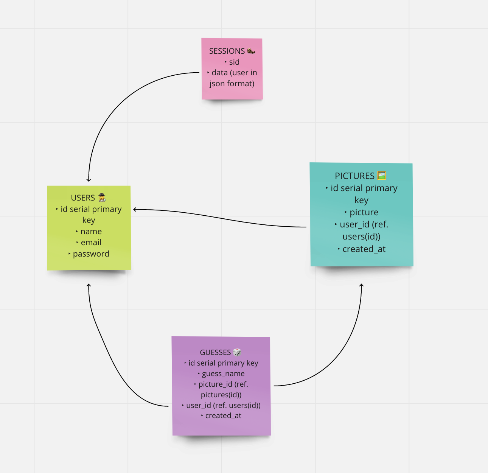

# Want to solve a mystery? 🧐

## Week 4 - CASE


### How to install

- Download files
- `cd` to the main folder
- `npm install` to install the modules cited in `package.json` file

### Technical criteria 🦹

- Express server ✔️
- Modular codebase ✔️
- `PostgreSQL` database ✔️
- Hosted on `Heroku` ✔️
- One of the spike topics ✔️
  - upload files
- Validate user-submitted data
- Handle errors and inform the user ✔️
- Styled appropriately

### User stories 🕵️‍♀️

As a user, I want:

- Create an account before uploading a picture
- Receive a message if something on my registration goes wrong
- Access the page with all the pictures uploaded to the application
- Click on a picture
- Come back later and see my picture is still there

### Acceptance criteria ✔

- Sign-up / Log-in forms
- Add picture form only available to logged in users
- Page showing all pictures
- Individual page for each picture
- Semantic HTML
- PostgreSQL database hosted on Heroku
- Secret environment variables

### Future Improvements 🔩

- Improve CSS for all pages
- Tests for all routes
- Individual page for each user
- Flash messages
- GitHub actions CI

### Schema 🍥



### What we learnt 📚 🤓

- How to upload local files to a database using `multer`
- Creating effective schemas to handle the information
- Authorizing access to users
- Session management (with cookies)
- Working with async code to solve database race conditions.
- Deploy to `Heroku` and configure environment variables there
- Using console and `Heroku` logs to debug

### Bugs 🐞 🪲

- In home page, we first placed the following line outside the `if...else` statement:

```js
response.send(layoutHTML('Home', homeHtml));
```

As a result the home page was not rendering even when the user was successfully logged in.

💡 To solve this:
We moved this line once in the `if` statement and once in the `else`.
